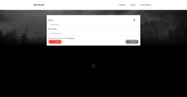
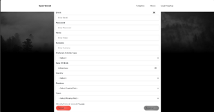
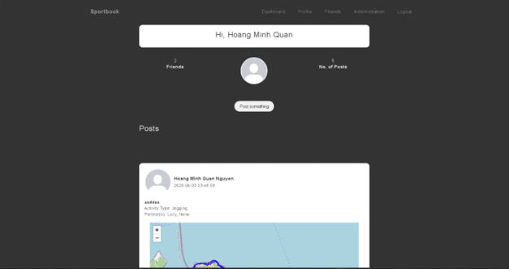
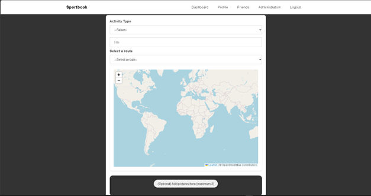
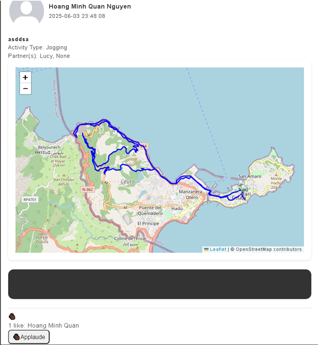
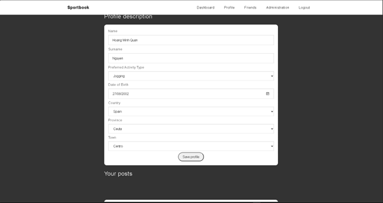
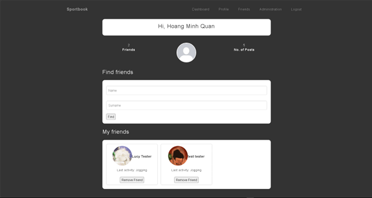
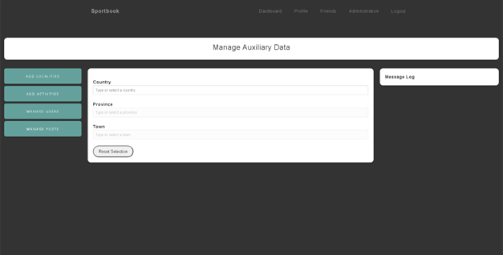

# Sportbook
a web-based client-server application that serves as a social network for sports activities, where users can share and view routes for activities like cycling, hiking, or running. The project must incorporate technologies and concepts taught in the course.

## The system will include the following main entities:
- User: Includes attributes like username, email, name, birth date, preferred activity, location (city, province, country), role (admin or user), friends (followers), and optional attributes for email validation.
- Location Entities: Country, Province, City (each with identifiers and names).
- Role: Admin or user.
- Activity Type: Preloaded with activities like Road Cycling, MTB, Hiking, Running.
- Images: Each user can upload multiple images.
- Profile Picture: One image can be marked as the profile picture.
- Activity: A user can post an activity with a title, type, GPX route file, participating friends, applause (likes), and images.
- Route: Identified by a GPX file.

## Functional Requirements

For Anonymous Users:
- Register (with optional email validation).
- Login (with username/email and password).

For Logged-In Users:
- Profile Management: Edit profile data.
- Post Activities: Share activity with route and images; reference friends using AJAX.
- User Search: Search by name; view limited profile if not friends.
- Friend Management: Add/remove friends.
- Activity Feed: See friends' activities (paginated).
- Activity View: Show activity type, title, route map, images, friends involved, applause count and users.

For Administrators:
- Manage Data: Add/edit/delete countries, provinces, cities, activity types.
- Dependent dropdowns for Country → Province → City (using AJAX).
- Manage Users: Search, edit, deactivate.
- Manage Activities and Images: Access all activities and remove inappropriate images.

# List of Used Libraries
1.	Bootstrap Bundle (v5.2.3)
2.	Lenis (Smooth Scrolling Library) (v1.1.14)
3.	GSAP (GreenSock Animation Platform) (v3.12.5)
4.	ScrollTrigger (v3.12.5)
5.	Leaflet (v1.9.4)
6.	Leaflet GPX
7.	Cropper.js (v1.5.13)
8.	Tom Select (v2.3.1)

## How to run the software
-	The software requires Wamp Server v3.3.7 and project source code that can be obtained via prado submission or github link: https://github.com/Ryuunsuke/sports-social-network
-	Once configuring either virtual folder or to its server folder then go to the url localhost where it will automically detect index.php, then you can navigate through the whole website.
-	The website is programmed with PHP for variables processing, HTML for displaying, CSS for layout, JavaScript for posting and getting the variables, as well as few visual improvements for user experience.
-	It uses MariaDB:3307 to store datas and retrieve from.

Example pages:

  

The start of the website

  

Template from bootstrap

  

Login form

  

Register form

  

Dashboard page

  

Posting an activity

  

An example post after posting

  

  

Friend page for user search engine and user display after adding

  

Admin page for managing datas

## Future updates
- Making posts able to add multiple user that the current user has added
- Admin page with more specific and detail functions
- Code optimizations

